# BPMN 2.0 by Example(OMG dtc/2010-06-02)——頁包查閱版

> 查閱方式:先看下方章節索引找頁碼 → `grep -n "^## p." 本檔` 定位行號 →
> `view` 對應行段讀文字;**圖面細節另 view `reference/bpmn_pages/pNN.jpeg`**。
> 共 27 頁,請勿整檔讀入。純文字頁(p.15/33/35/43/45/46)無頁圖、
> 段內標記「(純文字頁,無頁圖)」,文字即全部內容。
> 本檔為裁減版:已移除前言/法務(p.01–10)、Incident Mgmt 執行版 XML(p.22–26)、
> 第 11 章 Correlation(p.39–42)、Annex A(p.47);**頁碼沿用原序、有跳號**。

## 章節索引(頁碼=`## p.NN` 錨點)

| 章節 | 頁 |
|---|---|
| 5 Small Examples(Shipment/Pizza/Order Fulfillment/Procurement) | 11–15 |
| 6 Incident management(高階/協作/編排/人機分工) | 16–21 |
| 7 Models and Diagrams(Lane/Pool/子流程/Call Activity) | 27–32 |
| 8 Nobel Prize Example | 33–34 |
| 9 Travel Booking Example(事件子流程/補償) | 35–36 |
| 10 Diagram Interchange 圖例(巢狀泳道/**直式協作**/會話/編排) | 37–38 |
| 12 E-Mail Voting Example(複雜迴圈/事件子流程) | 43–46 |

## p.11
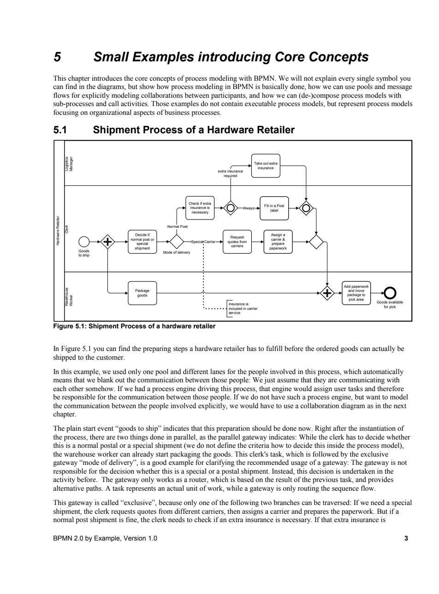

5 Small Examples introducing Core Concepts
This chapter introduces the core concepts of process modeling with BPMN. We will not explain every single symbol you
can find in the diagrams, but show how process modeling in BPMN is basically done, how we can use pools and message
flows for explicitly modeling collaborations between participants, and how we can (de-)compose process models with
sub-processes and call activities. Those examples do not contain executable process models, but represent process models
focusing on organizational aspects of business processes. 
5.1 Shipment Process of a Hardware Retailer
In Figure 5.1 you can find the preparing steps a hardware retailer has to fulfill before the ordered goods can actually be
shipped to the customer. 
In this example, we used only one pool and different lanes for the people involved in this process, which automatically
means that we blank out the communication between those people: We just assume that they are communicating with
each other somehow. If we had a process engine driving this process, that engine would assign user tasks and therefore
be responsible for the communication between those people. If we do not have such a process engine, but want to model
the communication between the people involved explicitly, we would have to use a collaboration diagram as in the next
chapter.
The plain start event “goods to ship” indicates that this preparation should be done now. Right after the instantiation of
the process, there are two things done in parallel, as the parallel gateway indicates: While the clerk has to decide whether
this is a normal postal or a special shipment (we do not define the criteria how to decide this inside the process model),
the warehouse worker can already start packaging the goods. This clerk's task, which is followed by the exclusive
gateway “mode of delivery”, is a good example for clarifying the recommended usage of a gateway: The gateway is not
responsible for the decision whether this is a special or a postal shipment. Instead, this decision is undertaken in the
activity before. The gateway only works as a router, which is based on the result of the previous task, and provides
alternative paths. A task represents an actual unit of work, while a gateway is only routing the sequence flow. 
This gateway is called “exclusive”, because only one of the following two branches can be traversed: If we need a special
shipment, the clerk requests quotes from different carriers, then assigns a carrier and prepares the paperwork. But if a
normal post shipment is fine, the clerk needs to check if an extra insurance is necessary. If that extra insurance is
BPMN 2.0 by Example, Version 1.0 3
Figure 5.1: Shipment Process of a hardware retailer
Hardware Retailer
LogisticsManager
Clerk Warehouse
Worker
Goods 
to ship
Decide if
normal post or 
special 
shipment
Package 
goods
Mode of delivery
Request 
quotes from 
carriers
Assign a 
carrier & 
prepare 
paperwork
Fill in a Post
label
Check if extra 
insurance is 
necessary
Take out extra 
insurance
Add paperwork 
and move 
package to 
pick area
Special Carrier
Normal Post
extra insurance
required
Always
Goods available 
for pick Insurance is 
included in carrier 
service

## p.12
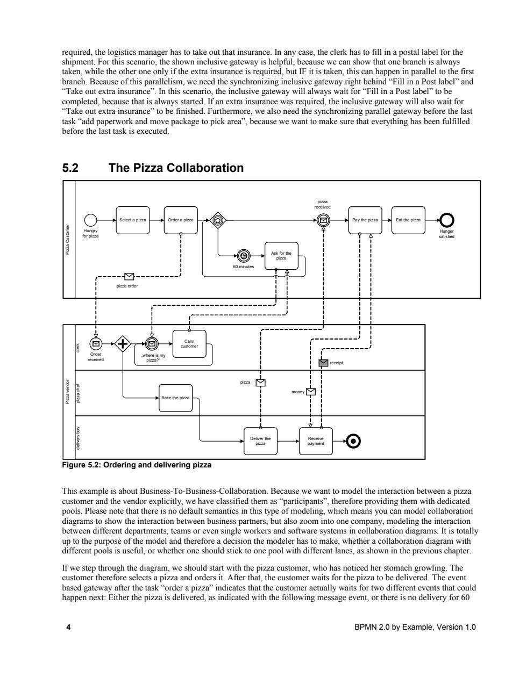

required, the logistics manager has to take out that insurance. In any case, the clerk has to fill in a postal label for the
shipment. For this scenario, the shown inclusive gateway is helpful, because we can show that one branch is always
taken, while the other one only if the extra insurance is required, but IF it is taken, this can happen in parallel to the first
branch. Because of this parallelism, we need the synchronizing inclusive gateway right behind “Fill in a Post label” and
“Take out extra insurance”. In this scenario, the inclusive gateway will always wait for “Fill in a Post label” to be
completed, because that is always started. If an extra insurance was required, the inclusive gateway will also wait for
“Take out extra insurance” to be finished. Furthermore, we also need the synchronizing parallel gateway before the last
task “add paperwork and move package to pick area”, because we want to make sure that everything has been fulfilled
before the last task is executed.
5.2 The Pizza Collaboration
This example is about Business-To-Business-Collaboration. Because we want to model the interaction between a pizza
customer and the vendor explicitly, we have classified them as “participants”, therefore providing them with dedicated
pools. Please note that there is no default semantics in this type of modeling, which means you can model collaboration
diagrams to show the interaction between business partners, but also zoom into one company, modeling the interaction
between different departments, teams or even single workers and software systems in collaboration diagrams. It is totally
up to the purpose of the model and therefore a decision the modeler has to make, whether a collaboration diagram with
different pools is useful, or whether one should stick to one pool with different lanes, as shown in the previous chapter. 
If we step through the diagram, we should start with the pizza customer, who has noticed her stomach growling. The
customer therefore selects a pizza and orders it. After that, the customer waits for the pizza to be delivered. The event
based gateway after the task “order a pizza” indicates that the customer actually waits for two different events that could
happen next: Either the pizza is delivered, as indicated with the following message event, or there is no delivery for 60
 4 BPMN 2.0 by Example, Version 1.0
Figure 5.2: Ordering and delivering pizza
Pizza Customer
Hungry
for pizza
Select a pizza Order a pizza
pizza
received
60 minutes
Ask for the 
pizza
Pay the pizza Eat the pizza
Hunger
satisfied
Pizza vendor
pizza chef delivery boy
Order
received
Bake the pizza
Deliver the 
pizza
Receive 
payment
pizza order
receipt
money
pizza
clerk
„where is my 
pizza?“
Calm
customer

## p.13
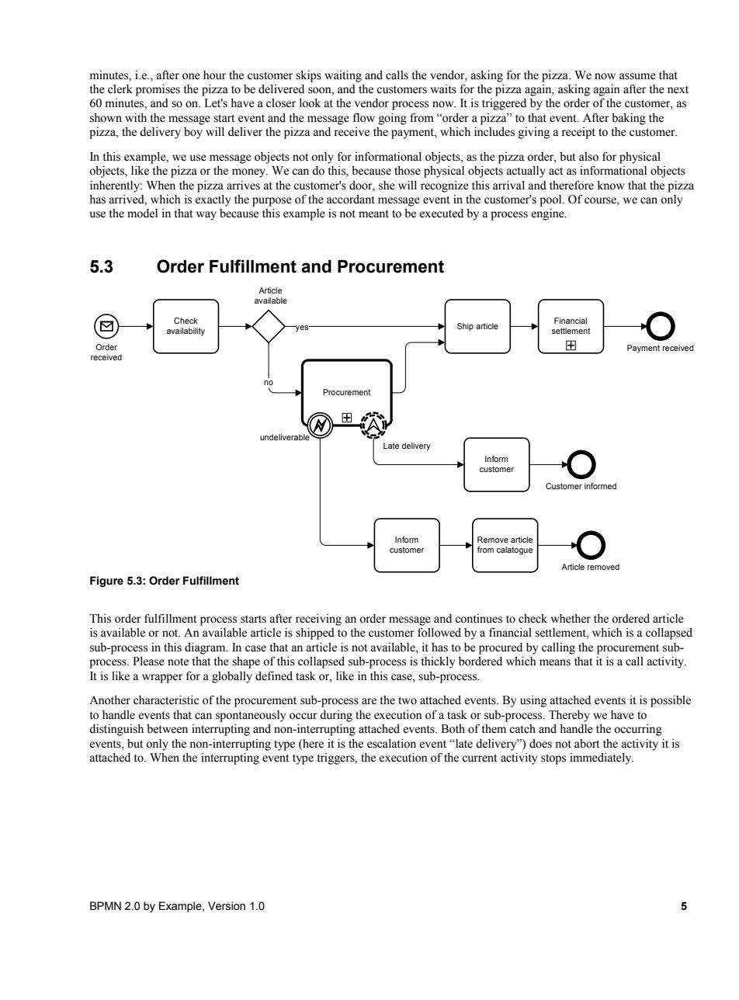

minutes, i.e., after one hour the customer skips waiting and calls the vendor, asking for the pizza. We now assume that
the clerk promises the pizza to be delivered soon, and the customers waits for the pizza again, asking again after the next
60 minutes, and so on. Let's have a closer look at the vendor process now. It is triggered by the order of the customer, as
shown with the message start event and the message flow going from “order a pizza” to that event. After baking the
pizza, the delivery boy will deliver the pizza and receive the payment, which includes giving a receipt to the customer.
In this example, we use message objects not only for informational objects, as the pizza order, but also for physical
objects, like the pizza or the money. We can do this, because those physical objects actually act as informational objects
inherently: When the pizza arrives at the customer's door, she will recognize this arrival and therefore know that the pizza
has arrived, which is exactly the purpose of the accordant message event in the customer's pool. Of course, we can only
use the model in that way because this example is not meant to be executed by a process engine.
5.3 Order Fulfillment and Procurement
This order fulfillment process starts after receiving an order message and continues to check whether the ordered article
is available or not. An available article is shipped to the customer followed by a financial settlement, which is a collapsed
sub-process in this diagram. In case that an article is not available, it has to be procured by calling the procurement subprocess. Please note that the shape of this collapsed sub-process is thickly bordered which means that it is a call activity.
It is like a wrapper for a globally defined task or, like in this case, sub-process.
Another characteristic of the procurement sub-process are the two attached events. By using attached events it is possible
to handle events that can spontaneously occur during the execution of a task or sub-process. Thereby we have to
distinguish between interrupting and non-interrupting attached events. Both of them catch and handle the occurring
events, but only the non-interrupting type (here it is the escalation event “late delivery”) does not abort the activity it is
attached to. When the interrupting event type triggers, the execution of the current activity stops immediately.
BPMN 2.0 by Example, Version 1.0 5
Figure 5.3: Order Fulfillment
Order
received
Check 
availability
Article
available
Procurement
no
yes Ship article
Late delivery
Inform 
customer
Customer informed
Financial 
settlement
Payment received
undeliverable
Inform 
customer
Remove article 
from calatogue
Article removed

## p.14
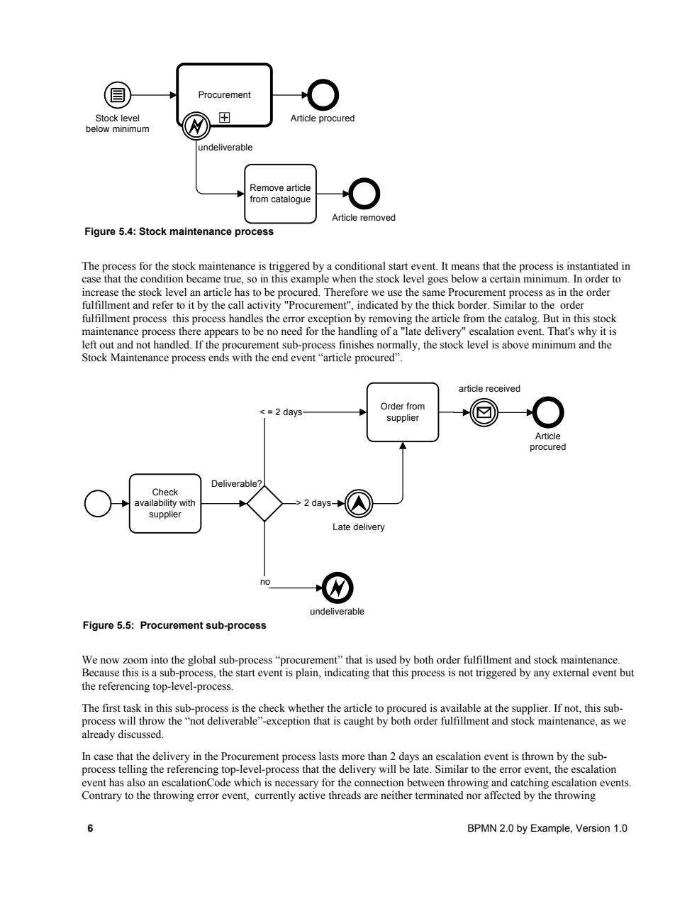

The process for the stock maintenance is triggered by a conditional start event. It means that the process is instantiated in
case that the condition became true, so in this example when the stock level goes below a certain minimum. In order to
increase the stock level an article has to be procured. Therefore we use the same Procurement process as in the order
fulfillment and refer to it by the call activity "Procurement", indicated by the thick border. Similar to the order
fulfillment process this process handles the error exception by removing the article from the catalog. But in this stock
maintenance process there appears to be no need for the handling of a "late delivery" escalation event. That's why it is
left out and not handled. If the procurement sub-process finishes normally, the stock level is above minimum and the
Stock Maintenance process ends with the end event “article procured”.
We now zoom into the global sub-process “procurement” that is used by both order fulfillment and stock maintenance.
Because this is a sub-process, the start event is plain, indicating that this process is not triggered by any external event but
the referencing top-level-process. 
The first task in this sub-process is the check whether the article to procured is available at the supplier. If not, this subprocess will throw the “not deliverable”-exception that is caught by both order fulfillment and stock maintenance, as we
already discussed.
In case that the delivery in the Procurement process lasts more than 2 days an escalation event is thrown by the subprocess telling the referencing top-level-process that the delivery will be late. Similar to the error event, the escalation
event has also an escalationCode which is necessary for the connection between throwing and catching escalation events.
Contrary to the throwing error event, currently active threads are neither terminated nor affected by the throwing
 6 BPMN 2.0 by Example, Version 1.0
Figure 5.4: Stock maintenance process
Stock level 
below minimum
Procurement
Article procured
undeliverable
Remove article 
from catalogue
Article removed
Figure 5.5: Procurement sub-process
Check 
availability with 
supplier
Deliverable?
Late delivery
Article 
procured
> 2 days
< = 2 days
undeliverable
no
article received
Order from 
supplier

## p.15
(純文字頁,無頁圖)

intermediate escalation event. Furthermore, the Procurement process continues its execution by waiting for the delivery.
But the thrown event is handled by the nearest parent activity with an attached intermediate escalation event which has
the same escalationCode as the thrown escalation event. In the order fulfillment process, the "late delivery" escalation
event attached to the Procurement sub-process catches the thrown "late delivery" event. But now, the event is a noninterrupting event. Because of that a new token is produced, follows the path of the escalation handling and triggers the
task that informs the customer that the ordered article will be shipped later. When the procurement sub-process finishes,
the Order Fulfillment process continues with the shipment of the article and the financial settlement.
BPMN 2.0 by Example, Version 1.0 7

## p.16
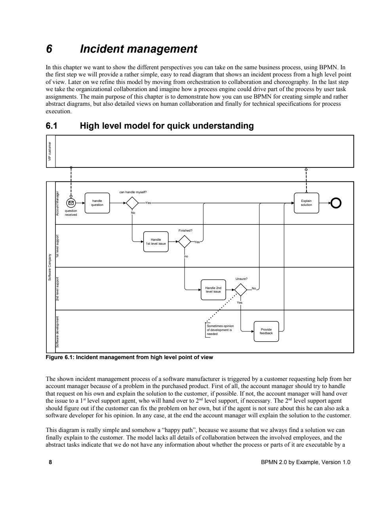

6 Incident management
In this chapter we want to show the different perspectives you can take on the same business process, using BPMN. In
the first step we will provide a rather simple, easy to read diagram that shows an incident process from a high level point
of view. Later on we refine this model by moving from orchestration to collaboration and choreography. In the last step
we take the organizational collaboration and imagine how a process engine could drive part of the process by user task
assignments. The main purpose of this chapter is to demonstrate how you can use BPMN for creating simple and rather
abstract diagrams, but also detailed views on human collaboration and finally for technical specifications for process
execution. 
6.1 High level model for quick understanding
The shown incident management process of a software manufacturer is triggered by a customer requesting help from her
account manager because of a problem in the purchased product. First of all, the account manager should try to handle
that request on his own and explain the solution to the customer, if possible. If not, the account manager will hand over
the issue to a 1st level support agent, who will hand over to 2nd level support, if necessary. The 2nd level support agent
should figure out if the customer can fix the problem on her own, but if the agent is not sure about this he can also ask a
software developer for his opinion. In any case, at the end the account manager will explain the solution to the customer. 
This diagram is really simple and somehow a “happy path”, because we assume that we always find a solution we can
finally explain to the customer. The model lacks all details of collaboration between the involved employees, and the
abstract tasks indicate that we do not have any information about whether the process or parts of it are executable by a
 8 BPMN 2.0 by Example, Version 1.0
Figure 6.1: Incident management from high level point of view
VIP customer Software Company
Account Manager 1st level support
question
received
handle 
question
can handle myself?
Handle
1st level issue
Yes
No
2nd level support
Handle 2nd 
level issue
Provide 
feedback
Finished?
no
Software development
Unsure?
Yes
Explain 
solution
Yes
No
Sometimes opinion 
of development is 
needed

## p.17
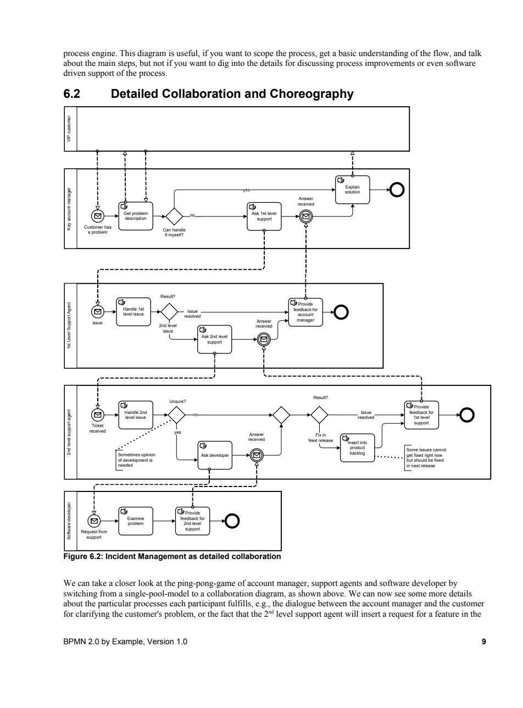

process engine. This diagram is useful, if you want to scope the process, get a basic understanding of the flow, and talk
about the main steps, but not if you want to dig into the details for discussing process improvements or even software
driven support of the process. 
6.2 Detailed Collaboration and Choreography
We can take a closer look at the ping-pong-game of account manager, support agents and software developer by
switching from a single-pool-model to a collaboration diagram, as shown above. We can now see some more details
about the particular processes each participant fulfills, e.g., the dialogue between the account manager and the customer
for clarifying the customer's problem, or the fact that the 2nd level support agent will insert a request for a feature in the
BPMN 2.0 by Example, Version 1.0 9
Figure 6.2: Incident Management as detailed collaboration
VIP customer Key account manager 1st Level Support Agent
issue
Handle 1st 
level issue
Provide 
feedback for 
account 
manager
2nd level support agent
Ticket
received
Handle 2nd 
level issue
Unsure?
Provide 
feedback for 
1st level 
support
Ask developer
Software developer
Request from 
support
Examine 
problem
Provide 
feedback for 
2nd level 
support
no
yes
Customer has
a problem
Get problem 
description
Can handle
It myself?
Explain 
solution
Ask 1st level 
support
Answer
received
no
yes
Sometimes opinion 
of development is 
needed
Result?
Issue
resolved
Ask 2nd level 
support
Answer
2nd level recevied
issue
Answer
received
Result?
Issue
resolved
Insert into 
product 
backlog
Fix in
Next release
Some issues cannot 
get fixed right now 
but should be fixed 
in next release

## p.18
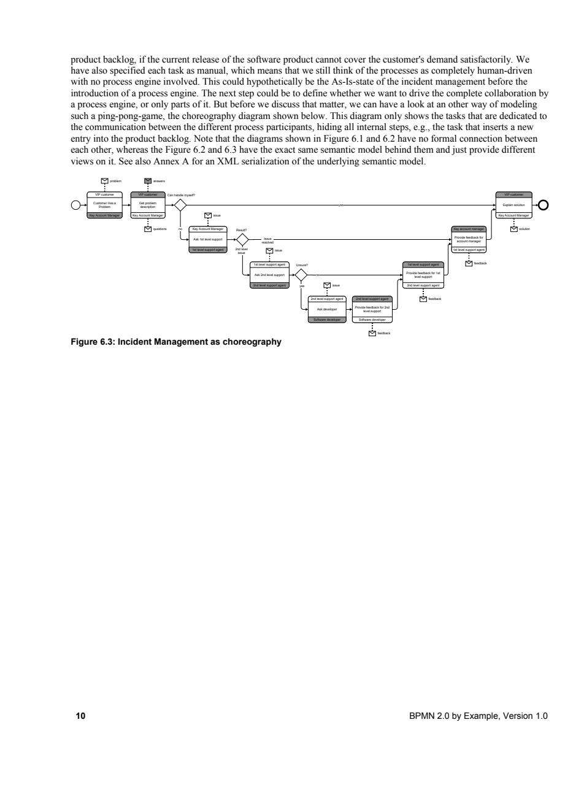

product backlog, if the current release of the software product cannot cover the customer's demand satisfactorily. We
have also specified each task as manual, which means that we still think of the processes as completely human-driven
with no process engine involved. This could hypothetically be the As-Is-state of the incident management before the
introduction of a process engine. The next step could be to define whether we want to drive the complete collaboration by
a process engine, or only parts of it. But before we discuss that matter, we can have a look at an other way of modeling
such a ping-pong-game, the choreography diagram shown below. This diagram only shows the tasks that are dedicated to
the communication between the different process participants, hiding all internal steps, e.g., the task that inserts a new
entry into the product backlog. Note that the diagrams shown in Figure 6.1 and 6.2 have no formal connection between
each other, whereas the Figure 6.2 and 6.3 have the exact same semantic model behind them and just provide different
views on it. See also Annex A for an XML serialization of the underlying semantic model.
 10 BPMN 2.0 by Example, Version 1.0
Figure 6.3: Incident Management as choreography
Key Account Manager
VIP customer
answers
questions
Get problem 
description
Key Account Manager
VIP customer
solution
Explain solution
1st level support agent
Key Account Manager
issue
Ask 1st level support
2nd level support agent
1st level support agent
issue
Ask 2nd level support
Software developer
2nd level support agent
issue
Ask developer
2nd level support agent
1st level support agent
feedback
Provide feedback for 1st 
level support
1st level support agent
Key account manager
feedback
Provide feedback for 
account manager
Can handle myself?
Result?
yes
Issue
resolved
2nd level
issue
Unsure?
no
Software developer
2nd level support agent
feedback
Provide feedback for 2nd 
level support
yes
no
Key Account Manager
VIP customer
problem
Customer Has a 
Problem

## p.19
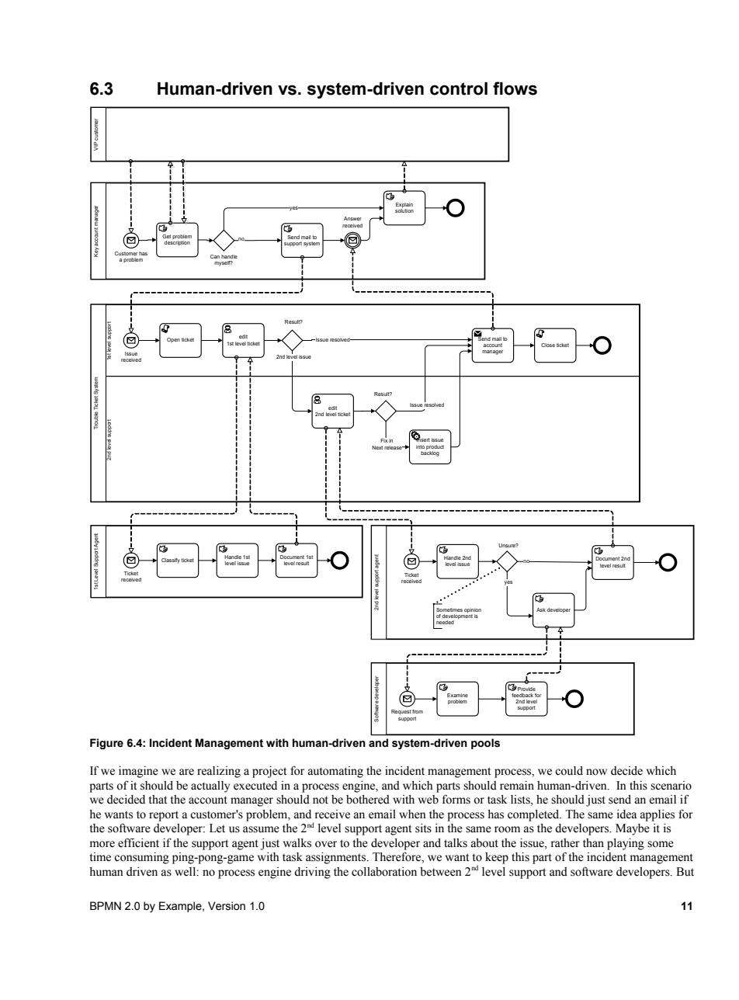

6.3 Human-driven vs. system-driven control flows
If we imagine we are realizing a project for automating the incident management process, we could now decide which
parts of it should be actually executed in a process engine, and which parts should remain human-driven. In this scenario
we decided that the account manager should not be bothered with web forms or task lists, he should just send an email if
he wants to report a customer's problem, and receive an email when the process has completed. The same idea applies for
the software developer: Let us assume the 2nd level support agent sits in the same room as the developers. Maybe it is
more efficient if the support agent just walks over to the developer and talks about the issue, rather than playing some
time consuming ping-pong-game with task assignments. Therefore, we want to keep this part of the incident management
human driven as well: no process engine driving the collaboration between 2nd level support and software developers. But
BPMN 2.0 by Example, Version 1.0 11
Figure 6.4: Incident Management with human-driven and system-driven pools
VIP customer Key account manager Trouble Ticket System
1st level support 2nd level support
Issue
received
Open ticket edit 
1st level ticket
Result?
Send mail to 
account 
manager
Close ticket
edit 
2nd level ticket
Result?
Insert issue 
into product 
backlog
1st Level Support Agent
Ticket
received
Classify ticket Handle 1st 
level issue
Document 1st 
level result
2nd level support agent
Ticket
received
Handle 2nd 
level issue
Unsure?
Document 2nd 
level result
Ask developer
Software developer
Request from 
support
Examine 
problem
Provide 
feedback for 
2nd level 
support
no
yes
Issue resolved
2nd level issue
Issue resolved
Fix in
Next release
Customer has
a problem
Get problem 
description
Can handle
myself?
Explain 
solution
Send mail to 
support system
Answer
received
no
yes
Sometimes opinion 
of development is 
needed

## p.20
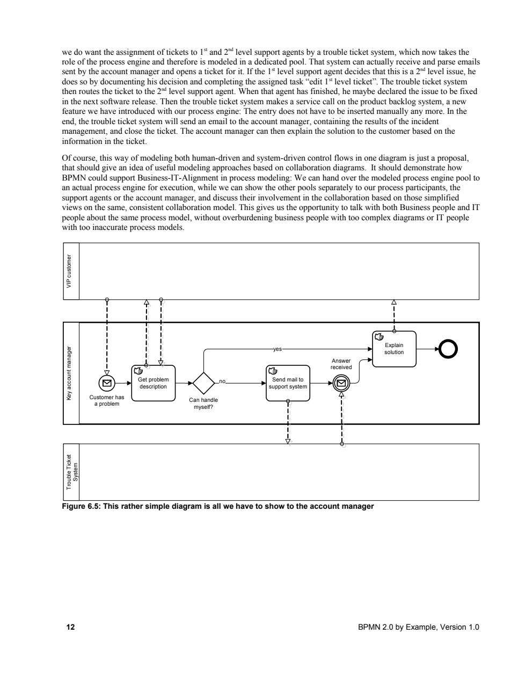

we do want the assignment of tickets to 1st and 2nd level support agents by a trouble ticket system, which now takes the
role of the process engine and therefore is modeled in a dedicated pool. That system can actually receive and parse emails
sent by the account manager and opens a ticket for it. If the 1st level support agent decides that this is a 2nd level issue, he
does so by documenting his decision and completing the assigned task “edit 1st level ticket”. The trouble ticket system
then routes the ticket to the 2nd level support agent. When that agent has finished, he maybe declared the issue to be fixed
in the next software release. Then the trouble ticket system makes a service call on the product backlog system, a new
feature we have introduced with our process engine: The entry does not have to be inserted manually any more. In the
end, the trouble ticket system will send an email to the account manager, containing the results of the incident
management, and close the ticket. The account manager can then explain the solution to the customer based on the
information in the ticket. 
Of course, this way of modeling both human-driven and system-driven control flows in one diagram is just a proposal,
that should give an idea of useful modeling approaches based on collaboration diagrams. It should demonstrate how
BPMN could support Business-IT-Alignment in process modeling: We can hand over the modeled process engine pool to
an actual process engine for execution, while we can show the other pools separately to our process participants, the
support agents or the account manager, and discuss their involvement in the collaboration based on those simplified
views on the same, consistent collaboration model. This gives us the opportunity to talk with both Business people and IT
people about the same process model, without overburdening business people with too complex diagrams or IT people
with too inaccurate process models.
 12 BPMN 2.0 by Example, Version 1.0
Figure 6.5: This rather simple diagram is all we have to show to the account manager
VIP customer Key account manager
Customer has
a problem
Get problem 
description
Can handle
myself?
Explain 
solution
Send mail to 
support system
Answer
received
no
yes
Trouble Ticket
System

## p.21
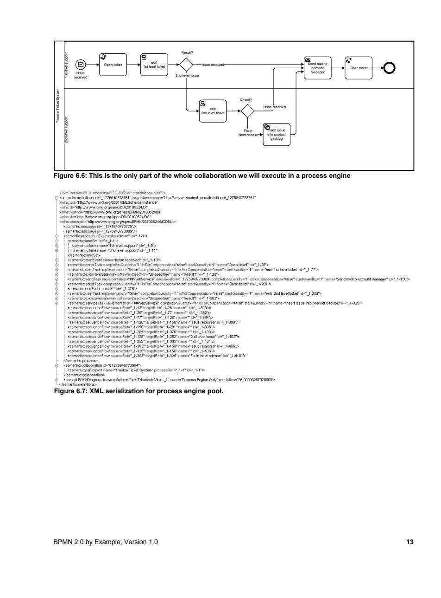

BPMN 2.0 by Example, Version 1.0 13
Figure 6.6: This is the only part of the whole collaboration we will execute in a process engine
Trouble Ticket System
1st level support 2nd level support
Issue
received
Open ticket edit 
1st level ticket
Result?
Send mail to 
account 
manager
Close ticket
edit 
2nd level ticket
Result?
Insert issue 
into product 
backlog
Issue resolved
2nd level issue
Issue resolved
Fix in
Next release
Figure 6.7: XML serialization for process engine pool.

## p.27
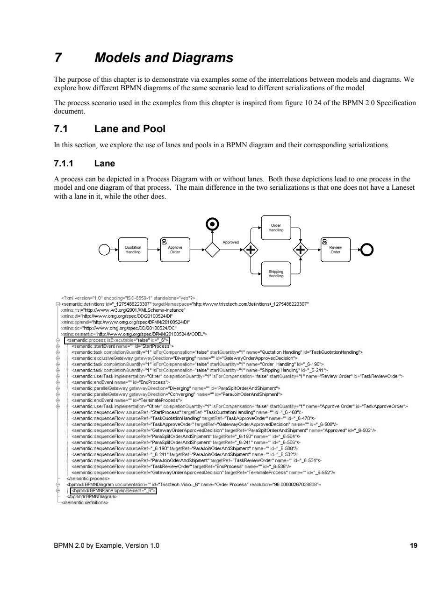

7 Models and Diagrams
The purpose of this chapter is to demonstrate via examples some of the interrelations between models and diagrams. We
explore how different BPMN diagrams of the same scenario lead to different serializations of the model. 
The process scenario used in the examples from this chapter is inspired from figure 10.24 of the BPMN 2.0 Specification
document.
7.1 Lane and Pool
In this section, we explore the use of lanes and pools in a BPMN diagram and their corresponding serializations.
7.1.1 Lane
A process can be depicted in a Process Diagram with or without lanes. Both these depictions lead to one process in the
model and one diagram of that process. The main difference in the two serializations is that one does not have a Laneset
with a lane in it, while the other does.
BPMN 2.0 by Example, Version 1.0 19
Quotation 
Handling
Order 
Handling
Shipping 
Handling
Review
Order
Approved
Approve
Order

## p.28
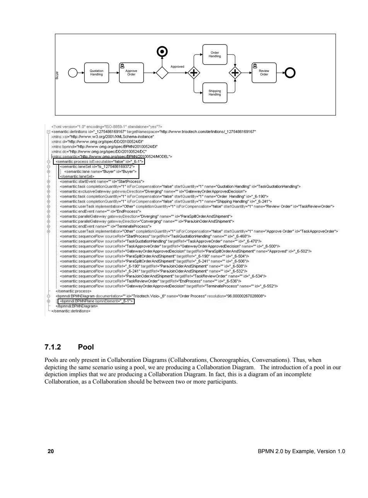

7.1.2 Pool
Pools are only present in Collaboration Diagrams (Collaborations, Choreographies, Conversations). Thus, when
depicting the same scenario using a pool, we are producing a Collaboration Diagram. The introduction of a pool in our
depiction implies that we are producing a Collaboration Diagram. In fact, this is a diagram of an incomplete
Collaboration, as a Collaboration should be between two or more participants.
 20 BPMN 2.0 by Example, Version 1.0
Quotation 
Handling
Order 
Handling
Shipping 
Handling
Review
Order
Approved
Approve
Order
Buyer

## p.29
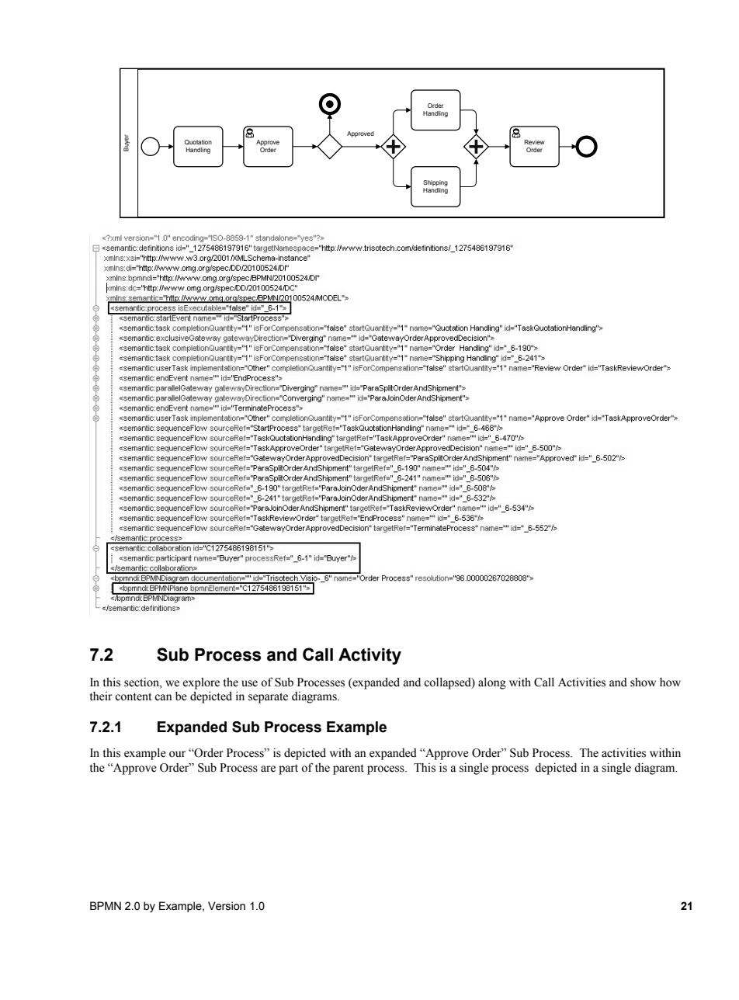

7.2 Sub Process and Call Activity
In this section, we explore the use of Sub Processes (expanded and collapsed) along with Call Activities and show how
their content can be depicted in separate diagrams.
7.2.1 Expanded Sub Process Example
In this example our “Order Process” is depicted with an expanded “Approve Order” Sub Process. The activities within
the “Approve Order” Sub Process are part of the parent process. This is a single process depicted in a single diagram. 
BPMN 2.0 by Example, Version 1.0 21
Quotation 
Handling
Order 
Handling
Shipping 
Handling
Review
Order
Approved
Approve
B
Order
uyer

## p.30
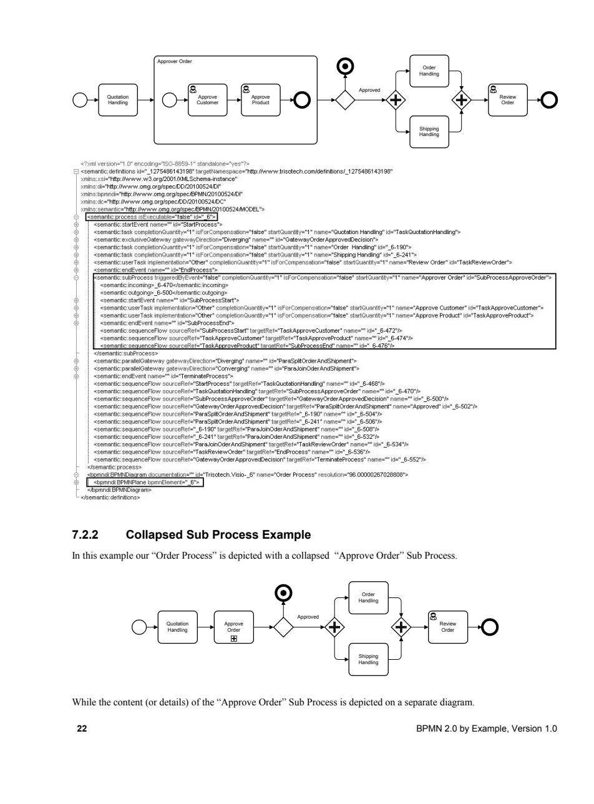

7.2.2 Collapsed Sub Process Example
In this example our “Order Process” is depicted with a collapsed “Approve Order” Sub Process. 
While the content (or details) of the “Approve Order” Sub Process is depicted on a separate diagram.
 22 BPMN 2.0 by Example, Version 1.0
Quotation 
Handling
Approve
Customer
Order 
Handling
Shipping 
Handling
Review
Order
Approver Order
Approve
Product
Approved
Quotation 
Handling
Order 
Handling
Shipping 
Handling
Review
Order
Approved
Approve
Order

## p.31
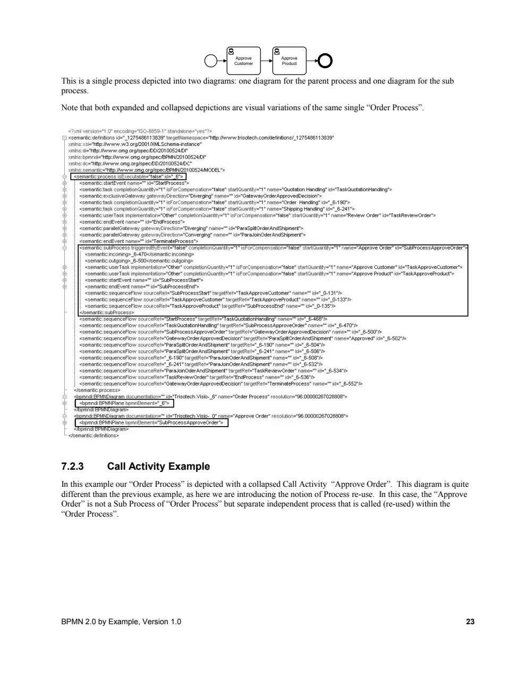

This is a single process depicted into two diagrams: one diagram for the parent process and one diagram for the sub
process. 
Note that both expanded and collapsed depictions are visual variations of the same single “Order Process”.
7.2.3 Call Activity Example
In this example our “Order Process” is depicted with a collapsed Call Activity “Approve Order”. This diagram is quite
different than the previous example, as here we are introducing the notion of Process re-use. In this case, the “Approve
Order” is not a Sub Process of “Order Process” but separate independent process that is called (re-used) within the
“Order Process”.
BPMN 2.0 by Example, Version 1.0 23
Approve
Customer
Approve
Product

## p.32
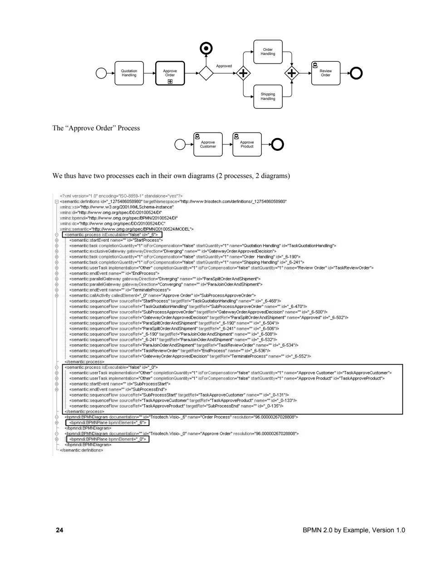

The “Approve Order” Process 
We thus have two processes each in their own diagrams (2 processes, 2 diagrams)
 24 BPMN 2.0 by Example, Version 1.0
Quotation 
Handling
Order 
Handling
Shipping 
Handling
Review
Order
Approved
Approve
Order
Approve
Customer
Approve
Product

## p.33
(純文字頁,無頁圖)

8 Nobel Prize Example
8.1 The Nobel Prize Process Scenario
The selection of a Nobel Prize Laureate is a lengthy and carefully executed process. The processes slightly differ for each
of the six prizes; the results are the same for each of the six categories. 
Following is the description for the Nobel Prize in Medicine. The main actors in the processes for Nomination, Selection
and Accepting and Receiving the award are the:
• Nobel Committee for Medicine,
• Nominators,
• Specially appointed experts,
• Nobel Assembly and
• Nobel Laureates.
Each year in September, in the year preceding the year the Prize is awarded, around 3000 invitations or confidential
nomination forms are sent out by the Nobel Committee for Medicine to selected Nominators. 
The Nominators are given the opportunity to nominate one or more Nominees. The completed forms must be made
available to the Nobel Committee for Medicine for the selection of the preliminary candidates. 
The Nobel Committee for Medicine performs a first screening and selects the preliminary candidates.
Following this selection, the Nobel Committee for Medicine may request the assistance of experts. If so, it sends the list
with the preliminary candidates to these specially appointed experts with the request to assess the preliminary candidates’
work.
From this, the recommended final candidate laureates and associated recommended final works are selected and the
Nobel Committee for Medicine writes the reports with recommendations.
The Nobel Committee for Medicine submits the report with recommendations to the Nobel Assembly. This report
contains the list of final candidates and associated works.
The Nobel Assembly chooses the Nobel Laureates in Medicine and associated through a majority vote and the names of
the Nobel Laureates and associated works are announced. The Nobel Assembly meets twice for this selection. In the first
meeting of the Nobel Assembly the report is discussed. In the second meeting the Nobel Laureates in Medicine and
associated works are chosen.
The Nobel Prize Award Ceremony is held in Stockholm.
BPMN 2.0 by Example, Version 1.0 25

## p.34
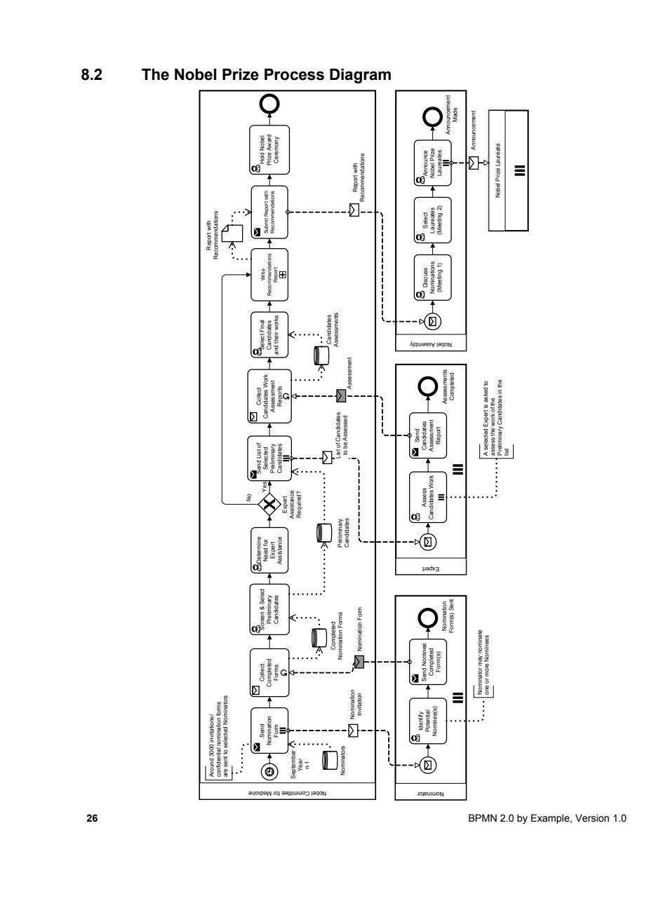

8.2 The Nobel Prize Process Diagram
 26 BPMN 2.0 by Example, Version 1.0
Completed
Nomination Forms
eni ci de Mr of eetti mmo Cl ebo N r ot ani mo N
tr epxE
September
Year
n-1
Send
Nomination
Form
Identify
Potential
Nominee(s)
Send Nominee
Completed
Form(s)
Collect
Completed
Forms
Nomination
Invitation Nomination Form
Screen & Select
Preliminary
Candidates
Send List of
Selected
Preliminary
Candidates
Assess
Candidates Work
Send
Candidates
Assessment
Report
Collect
Candidates Work
Assessment
Reports
Nominator may nominateone or more Nominees
Around 3000 invitations/confidential nomination formsare sent to selected Nominators
Preliminary
Candidates
Candidates
Assessments
Expert
Assistance
Required?
Yes
List of Candidates
to be Assessed
Assessment
No
Nomination
Form(s) Sent
Determine
Need for
Expert
Assistance
Assessments
Completed
Nominators
Write
Recommendations
Report
Submit Report with
Recommendations
Hold Nobel
Prize Award
Ceremony
Report with
Recommendations
yl b mess Al ebo N
Announce
Nobel Prize
Laureates
Announcement
Made
Discuss
Nominations
(Meeting 1)
Select
Laureates
(Meeting 2)
Nobel Prize Laureate
Announcement
Report with
Recommendations
Select Final
Candidates
and their works
A selected Expert is asked toassess the work of thePreliminary Candidates in thelist

## p.35
(純文字頁,無頁圖)

9 Travel Booking Example
The purpose of this chapter is to provide an example of in-line event handling via event sub-process constructs. 
The process scenario is inspired from figure 10.100 of the BPMN 2.0 Specification document.
9.1 The Travel Booking Scenario
The Travel Agency receives a travel reservation request, including airline transportation and hotel reservation, from a
Client.
Following research and evaluation of both flights’ and hotel rooms’ availability, selected alternatives are packaged and
offered to the Client.
The Client has 24 hours to either select a proposed alternative or cancel the request. In case of a cancellation, or after this
delay, the Agency updates the Client record to reflect the request cancellation and the Client is notified.
When a selection is made, the Client is asked to provide the Credit Card information. Again, the Client has 24 hours to
provide this information or the request is canceled via the same activities stated before (update and notification).
Having received the Credit Card information, the booking activities take place:
The flight and the hotel room are booked. Measures are taken to insure reservations reversals if problems occur in the
booking and payment activities. The Client is also entitled to provide the Agency with Credit Card Information
modifications before the booking is completed. Such information will be saved in its record.
If an error arises during the booking activities, the flight and hotel room reservations are reversed and the Client record is
updated. The booking is tried again as long as the booking retry limit is not exceeded. 
Following successful booking the Reservations are charged on the Client’s Credit Card and the process stops following
successful confirmation. If an error occurs during this activity the flight and hotel room reservation are reversed. The
Client is asked again for the Credit Card Information and the booking is tried again as long as the payment processing
retry limit is not exceeded.
In both cases, following the error, when the retry limit is exceeded, the Client is notified and the process stops. 
BPMN 2.0 by Example, Version 1.0 27

## p.36
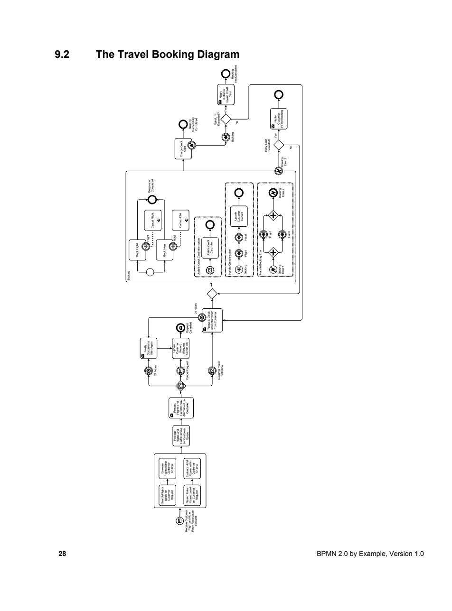

9.2 The Travel Booking Diagram
 28 BPMN 2.0 by Example, Version 1.0
Receive Customer
Flight and Hotel
Room Reservation
Request
Search Flights
based on
Customer
Request
Evaluate
Flights within
Customer
Criteria
Search Hotel
Rooms based
on Customer
Request
Evaluate Hotel
Rooms within
Customer
Criteria
Package
Flights and
Hotel Roomsfor Customer
Review
Present
Flights and
Hotel Rooms
Alternatives to
Customer
24 hours
Cancel Request
Customer make
Selection
Update
Customer
Record
(Request
Cancelled)
Notify
Customer to
Start Again
Request Credit
Card Information
from Customer
24 Hours
Request
Cancelled
Booking
Book Flight
Book Hotel
Flight
Hotel
Cancel Flight
Cancel Hotel
Reservation
Completed
Update Credit Card Information
Update Credit
Card Info
Handle Compensation
Booking Flight Hotel
Update
Customer
Record
Handle Booking Error
Booking
Error 1
Flight
Hotel
Booking
Error 2
Booking
Error 2
Charge Credit
Card
Booking
Successfully
Completed
Booking
Retry Limit
Exceeded?
Notify
Customer
Invalid Credit
Card
Booking
Not Completed
Yes
No
Retry Limit
Exceeded?
No
Notify
Customer
Failed Booking
Yes

## p.37
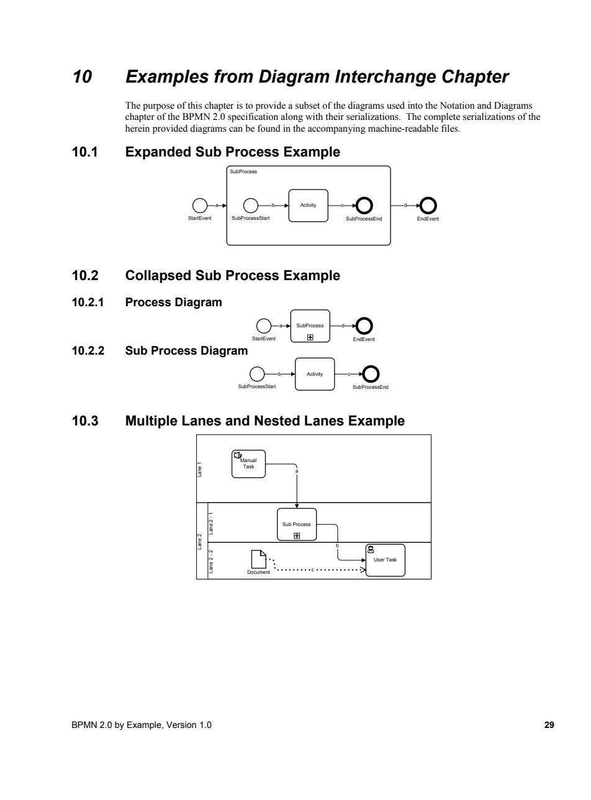

10 Examples from Diagram Interchange Chapter
The purpose of this chapter is to provide a subset of the diagrams used into the Notation and Diagrams
chapter of the BPMN 2.0 specification along with their serializations. The complete serializations of the
herein provided diagrams can be found in the accompanying machine-readable files.
10.1 Expanded Sub Process Example
10.2 Collapsed Sub Process Example
10.2.1 Process Diagram
10.2.2 Sub Process Diagram
10.3 Multiple Lanes and Nested Lanes Example
BPMN 2.0 by Example, Version 1.0 29
StartEvent
SubProcess
SubProcessStart
Activity
SubProcessEnd EndEvent
a b c d
StartEvent EndEvent
a SubProcess d
SubProcessStart
Activity
SubProcessEnd
b c
Lane 1 Lane 2
Manual 
Task
Lane 2 - 1 Lane 2 - 2
Sub Process
User Task
Document c
a
b

## p.38
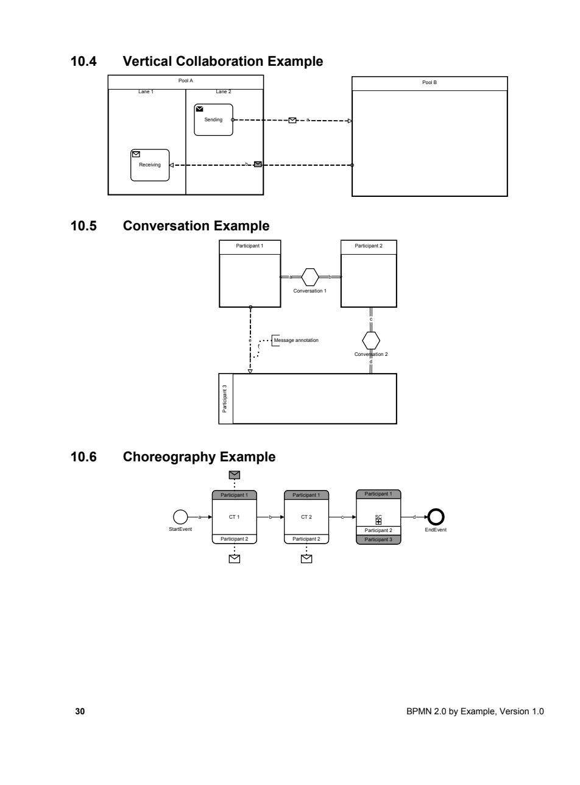

10.4 Vertical Collaboration Example
10.5 Conversation Example
10.6 Choreography Example
 30 BPMN 2.0 by Example, Version 1.0
StartEvent
Participant 2
Participant 1
CT 1
Participant 2
Participant 1
CT 2
Participant 2
Participant 1
Participant 3
SC
EndEvent
a b c d
Pool A Pool B
Lane 1 Lane 2
Sending
Receiving b
a
Participant 1 Participant 2
Participant 3
Message annotation
Conversation 1
Conversation 2
a b
c
d
e
f

## p.43
(純文字頁,無頁圖)

12 E-Mail Voting Example
This chapter will provide an example of a business process modeled with BPMN. This example was presented in the
BPMN 1.0 specification, but has been updated for BPMN 2.0. The process that will be described is a process used to help
develop this notation. It is a process for resolving issues through e-mail votes (see Figure). This Process is small, but
fairly complex and will provide examples for many of the features of BPMN, and it will help illustrate that BPMN can
handle simple and unusual business processes and still be easily understandable for readers of the Diagram. The sections
below will isolate segments of the Process and highlight the modeling features as the workings of the Process is
described.
BPMN 2.0 by Example, Version 1.0 35

## p.44
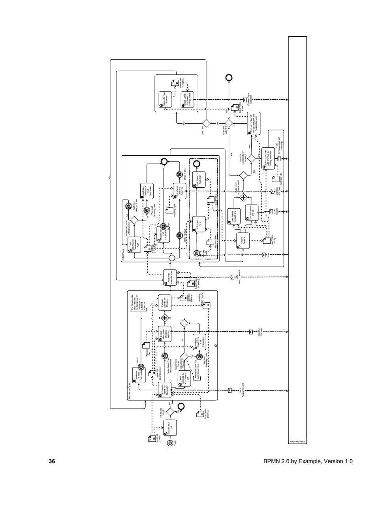

36 BPMN 2.0 by Example, Version 1.0 Friday Review Issue List Are issues ready? Issue List [Initial] No Discussion Cycle Announce Issues for Discussion Check Calendar for Conference Call Moderate E-mail Discussion 7 Days Delay 6 days from Announcement E-mail discussion Deadline Warning Evaluate Discussion Progress Conference Call in Discussion Week? Moderate Conference Call Discussion Wait until Thursday, 9 am No Yes Issue List [In Discussion] Conference Calls are every two weeks Warning Text The Process will loop if there is no discussion of the issues or sufficient solutionsIssue List [Ready] Issue List [Not Ready] Announce Issues for Vote Yes sr eb me Mgnit oV Issue Announcement Deadline Warning Collect Votes Check Calendar for Conference Call Moderate E- mail Discussion Delay 13 days Conference Call in Voting Week? Wait until Thursday, 9am Moderate Conference Call Discussion No Yes Issue List [In Voting] E-mail Vote Deadline Warning Delay 1 day Warning Text Receive Vote Increment Tally Post Status on Web Site Member Vote Issue Votes Prepare Results Post Results on Web Site E-mail Results of Vote Did Enough Members Vote? Reduce number of Voting Members and Recalculate Vote Have the Members been warned? Re-announce Vote with Warning to Voting Members Vote Announcement Vote Issue Votes [Final] No Issues w/o Majority? Yes Yes No Deadline Warning Vote Results Warning Text Vote announcement with Warning 2nd Time No Yes Reduce to Two Solutions E-mail Voters that have to Change Votes Issue Votes [Adjusted] No Yes Change Vote Message Issue Votes [Final 2] Issue Votes [Adjusted] Issue Votes [Final 2] Wait until Monday, 9 Am 14 Days

## p.45
(純文字頁,無頁圖)

The Process has a point of view that is from the perspective of the manager of the Issues List and the discussion around
this list. From that point of view, the voting members of the working group are considered as external Participants who
will be communicated with by messages (shown as Message Flow).
The Issue List Manager will review the list and determine if there are any issues that are ready for going through the
discussion and voting cycle. Then a Decision must be made. If there are no issues ready, then the Process is over for that
week--to be taken up again the following week. If there are issues ready, then the Process will continue with the
discussion cycle. The “Discussion Cycle” Sub-Process is the first activity after the “Any issues ready?” Decision and this
Sub-Process has two incoming Sequence Flow, one of which originates from a downstream Decision and is thus part of a
loop. It is one of a set of four (4) complex loops that exist in the Process. The contents of the “Discussion Cycle” SubProcess and the activities that follow will be described below. 
12.1 The First Sub-Process
The “Discussion Cycle” Sub-Process starts with a Task for the Issue List Manager to send an e-mail to the working group
that a set of Issues are now open for discussion through the working group’s message board. Since this Task sends a
message to an outside Participant (the working group members), an outgoing Message Flow is seen from the “Discussion
Cycle” Sub-Process to the “Voting Members” Pool in the Figure. Basically, the working group will be discussing the
issues for one week and proposing additional solutions to the issues. After the first Task, three separate parallel paths are
followed, which are synchronized downstream. This is shown by the three outgoing Sequence Flow for that activity.
The top parallel path in the figure starts with a long-running Task, “Moderate E-mail Discussion,” that has a Timer
Intermediate Event attached to its boundary. The “Moderate E-Mail Discussion” Task will never actually be completed
normally in this model, but will be interrupted by the Timer Intermediate Event.
The middle parallel path of the fork contains an Intermediate Event and a Task. A Timer Intermediate Event used in the
middle of the Process flow (not attached to the boundary of an activity) will cause a delay. This delay is set to 6 days.
The “E-Mail Discussion Deadline Warning” Task will follow. Again, since this Task sends a message to an outside
Participant, an outgoing Message Flow is seen from the “Discussion Cycle” Sub-Process to the “Voting Members” Pool
in the Figure.
The bottom parallel path of the fork contains more than one object, first of which is Task where the issue list manager
checks the calendar to see if there is a conference call this week. The output of the Task will be an update to the variable
“ConCall” (not seen), which will be true or false. After the Task, an Exclusive Gateway with its two Gates follows. The
“default” Flow connects directly to an merging Exclusive Gateway. A merging Exclusive Gateway is used in this
situation because the next object is a joining Parallel Gateway (the diamond with the cross in the center) that is used to
synchronize the three (3) parallel paths. If the merging Gateway was not used and both Sequence Flow connected to the
Parallel Gateway, the Process would have been stuck at the Parallel Gateway that would wait for a Token to arrive from
each of the incoming Sequence Flow. The “Yes” Sequence Flow will have a condition that checks the value of the
“ConCall” variable (set in the previous Task) to see if there will be a conference call during the week. If so, the Timer
Intermediate Event indicates delay, since all conference calls for the working group start at 9am PDT on Thursdays. The
Task for moderating the conference call follows the delay, which is followed by the merging Gateway. 
The merging Gateway in bottom path, the “Moderate E-mail Discussion” Task, and the “E-Mail Discussion Deadline
Warning” Task all flow into a synchronizing Parallel Gateway. This Gateway waits for all three paths to complete before
the Process will continue to the next Task, “Evaluate Discussion Progress.” The Issue List Manager will review the status
of the issues and the discussions during the past week and decide if the discussions are over. The “DiscussionOver”
variable (not seen) will be set to TRUE or FALSE, depending on this evaluation. If the variable is set to FALSE, then the
whole Sub-Process will be repeated, since it has looping set and the loop condition that will test the “DiscussionOver”
variable. 
12.2 The Second Sub-Process
The “Collect Votes” Sub-Process is preceded by a Task for the issue list manager to send out an e-mail to announce to
the working group, and the voting members in particular, which lets them know that the issues are now ready for voting.
Since this Task sends a message to an outside Participant (the working group members), an outgoing Message Flow is
seen from the “Announce Issues” Task to the “Voting Members” Pool in the Figure above. This Task is also a target for
one of the complex loops in the Process.
BPMN 2.0 by Example, Version 1.0 37

## p.46
(純文字頁,無頁圖)

The “Collect Votes” Sub-Process follows the Task, and is also a target of one of the looping Sequence Flow. This SubProcess is basically a set of three (3) parallel paths that extend from the beginning to the end of the Sub-Process. In
addition, there is a non-interrupting Event Sub-Process that is used to receive the votes from the voting members as they
come in.
The first branch of the fork leads to a Decision that determines whether or not a conference call will occur during the
upcoming week, after the Working Group’s schedule has been checked. Basically, if there was a call last week, then there
will not be a call this week and vice versa. If there is no call, then there is a Timer Intermediate Event that is set to wait
until the next Monday, then the path loops back. The appropriate variable that was updated in the “Discussion Cycle”
Process will be used again. 
The second and third branches of the forks work the same way as the similar activities in the “Discussion Cycle” SubProcess, except that it will last two weeks. However, since the branches lead to an End Event instead of a Parallel
Gateway, a merging Exclusive Gateway is not needed (the necessary synchronization will be done by the End Event).
The Event Sub-Process will accept votes from the voting members throughout the two weeks that the “Collect Votes”
Sub-Process runs. The policy of the working group is that voting members can vote more than once on an issue; that is,
they can change their mind as many times as they want throughout the entire two weeks. The Message Start Event
triggers the performance of the Event Sub-Process. It is of the non-interrupting type so that multiple votes can be
collected during the two weeks. As part of this, an incoming Message Flow is seen from the “Voting Members” Pool to
the “Receive Vote” Start Event. Within the Event Sub-Process are Two Tasks that follow the start. First, a Task will
prepare all the voting results, then a Task will send the results to the voting members. 
12.3 The End of the Process
The last section of the Process includes a complex set of Decisions and loops. First a set of Tasks will prepare the voting
results, email them to the voting members, and post them on a web site. The first Decision, “Did Enough Members
Vote?,” is necessary since two-thirds of the voting members are required to approve any solution to an issue. If less than
two-thirds of the voting members cast votes, which sometimes happens, the issues can’t be resolved. This Decision is
followed by another Decision for both of its Alternatives. The “No” Alternative is followed by the “Have the Members
been Warned?” Decision. If a voting member misses a vote, they are warned. If they miss a second vote, they lose their
status as a voting member and the voting percentages are recalculate through a Task (“Reduce number of Voting
Members and Recalculate Vote”). If they haven’t yet been warned, then a warning is sent and the voting cycle is
repeated. If all issues are resolved, then the Process is done. If not, then another Decision is required. The voting is given
two chances before it goes back to another cycle of discussion. The first time will see a reduction of the number of
solutions to the two most popular based on the vote (more if there are ties). Some voting members will have to change
their votes just because their selected solution is no longer valid. These two activities are placed in a Sub-Process to show
how a Sub-Process without Start and End Events can be used to create a simple set of parallel activities. Informally, this
is called a “parallel box.” It is not a special object, but another use of Sub-Processes. For simple situations, it can be used
to show a set of parallel activities without the extra clutter of a lot of Sequence Flow. In actuality, these two Tasks cannot
actually be done in parallel, but they are modeled this way to highlight the optional use of Start and End Events. After the
parallel box, the flow loops back to the “Collect Votes” Sub-Process. If there already has been two cycles of voting, then
the process Flow back to the “Decision Cycle” Sub-Process.
 38 BPMN 2.0 by Example, Version 1.0

